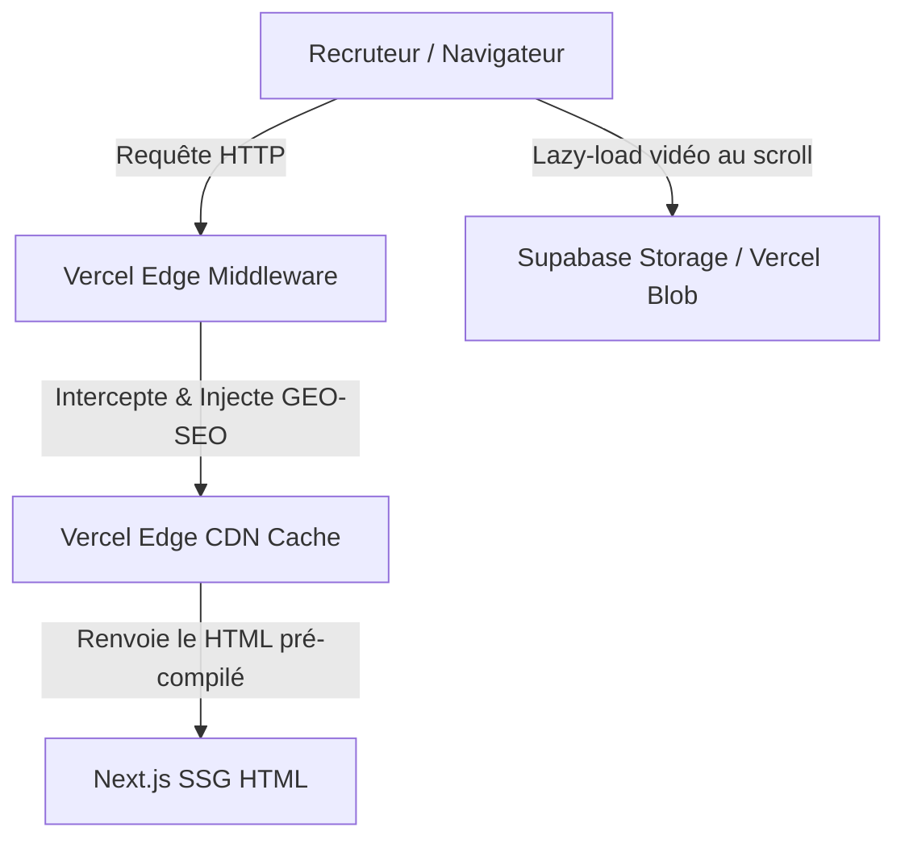

# Architecture Spine — Portfolio Koudous "The Process"

## Design Paradigm

**Jamstack Edge / SSG-First**. L'architecture est centrée sur le contenu (Markdown statique) généré à l'avance (Static Site Generation), combiné à des fonctions Edge extrêmement véloces (Vercel Edge Middleware) pour adapter le contenu statique aux visiteurs sans pénaliser le TTFB.

## Invariants & Rules

### AD-1 — Déploiement sur Vercel Edge

- **Binds:** Infra/Déploiement
- **Prevents:** La fragmentation du compute à l'Edge et les baisses de performances liées au réseau.
- **Rule:** Le projet complet (Frontend, Middleware) doit être déployé exclusivement sur Vercel. Tout middleware ou fonction serveur doit cibler le runtime "Edge".

### AD-2 — Framework Next.js App Router (RSC-First)

- **Binds:** Frontend Architecture
- **Prevents:** Le chargement de bundles JavaScript massifs qui tueraient le score Lighthouse.
- **Rule:** L'utilisation des *React Server Components* est la norme par défaut pour la structure de la page. Les *Client Components* (`"use client"`) sont strictement limités aux îles interactives (le lecteur vidéo, les panneaux deep-dive).

### AD-3 — Moteur d'Animation Dual (GSAP + Framer Motion)

- **Binds:** UI/Animations
- **Prevents:** Le "jank" (saccades) lors du scroll-scrubbing vidéo et les interfaces rigides.
- **Rule:** GSAP (avec ScrollTrigger) a l'exclusivité sur la synchronisation complexe du défilement et la lecture vidéo. Framer Motion gère toutes les autres micro-interactions UI pour garantir le feeling Premium / Glassmorphism.

### AD-4 — Injection GEO-SEO via Edge Middleware

- **Binds:** Routing/SEO
- **Prevents:** Le passage en rendu dynamique (SSR) qui invalide la génération statique.
- **Rule:** Les pages restent générées statiquement (SSG). Le SEO et GEO-localisé (Meta, JSON-LD) est injecté dynamiquement à la volée par le Vercel Edge Middleware en utilisant `HTMLRewriter` (ou des regex équivalentes sur l'Edge).

### AD-5 — Stockage Média sur CDN Externe (Supabase/Blob)

- **Binds:** Data/Media
- **Prevents:** Le gonflement extrême de l'historique Git et les lenteurs de buffering vidéo.
- **Rule:** Les fichiers vidéos bruts (MP4/WebM) sont hébergés sur un CDN externe performant (Supabase Storage ou Vercel Blob). Le dépôt Git source ne contient que les données textuelles et métadonnées (Markdown, JSON, strings BlurHash, VTT).

## Consistency Conventions

| Concern | Convention |
| --- | --- |
| Naming (entities, files) | Kebab-case pour les URLs et dossiers. PascalCase pour les composants React. |
| Données (Vidéos) | BlurHash natif obligatoire pour chaque vidéo avant le chargement complet pour assurer un Zero-Layout-Shift (ZLS). |
| SEO Sémantique | Obligation d'utiliser le JSON-LD avec les schémas `ProfessionalService` et `VideoObject`. |

## Stack

| Name | Version |
| --- | --- |
| Next.js (App Router) | >= 14 |
| React | 18+ / 19 |
| GSAP | ^3.12 |
| Framer Motion | ^11 |
| Vercel | Latest |
| TailwindCSS | (Optionnel / Si demandé) ou Vanilla CSS |

## Structural Seed



```text
/
  app/
    layout.tsx      # RSC principal
    page.tsx        # RSC de la timeline de Scrollytelling
  components/
    client/         # Les isolats interactifs ("use client", ex: GSAP Video Player)
    server/         # Les composants purement statiques (RSC)
  content/
    etapes/         # Fichiers Markdown pour les 13 étapes (métadonnées)
  middleware.ts     # Le routeur Edge qui fait la magie GEO-SEO
```

## Deferred

- **Le fournisseur CDN exact pour les vidéos** (Vercel Blob vs Supabase) est repoussé à la phase d'implémentation (PoC de validation des coûts/bande passante sur la couche gratuite).
